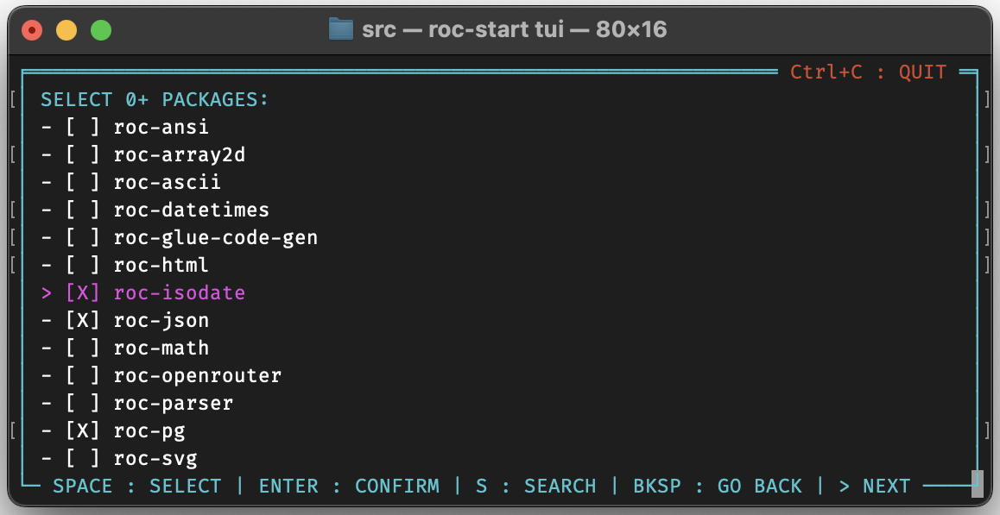

# `roc-start` CLI tool 🚀

[![Roc-Lang][roc_badge]][roc_link]
[![GitHub last commit][last_commit_badge]][last_commit_link]
[![CI status][ci_status_badge]][ci_status_link]

Roc-start is a CLI tool for generating application headers for a new roc application.

Starting a new roc app which requires multiple packages can be a bit cumbersome, due to the requirement for long urls which cannot be easily memorized. This typically requires opening previous projects which have some of the same dependencies, and copy/pasting from there, or visiting multiple github pages, finding the release page, and copying the url of the required assets.

Roc-start is intended to streamline this process.

Roc-start maintains a repository of package and platform git repos. From this list, it will fetch the latest release URLs for each of these packages and platforms. Then with a simple command, you can generate a new roc application file. Roc start even aids in platform and package discovery, by allowing you to browse and search for packages and platforms.

## Two workflows

1) Include the application name, platform, and packages as CLI args:
   - `roc-start my-app basic-cli weaver json`
2) Launch the TUI app to browse and search for packages and platforms:
   - `roc-start tui`


  

## Updating platform/package urls

The first time roc-start is run, it will automatically get the latest release urls for the platforms and packages in its repository. These can be updated again at any time by:

- Running with the `-u` / `--update` option (requires other valid args)
    - IE: `roc-start -u tui`
    - OR: `roc-start --update main basic-cli`

- If using `roc-start` `v0.3.4` or later, using the update command:
    - Update all: `roc-start update`
    - Update only selected, with `--platforms`, `--packages`, `--app-stubs`
    - IE: `roc-start update --packages`
    
> __Important:__
> Note that roc-start depends on the github cli tool to get the latest releases, and cannot run at all without `gh` installed.

## Dependencies

As mentioned above, `roc-start` depends on the [github cli](https://cli.github.com) tool to fetch the latest release urls. Please make sure to install and log into `gh` before running `roc-start`.

## Getting your package or platform added to roc-start

Please see [GET_LISTED](repository/GET_LISTED.md) for full instructions on getting your package or platform added to roc-start.

Note that some packages and platforms are already included in the repository, but do not appear in the TUI app, and cannot be imported by the CLI app. This is because these packages do not have a github release, or do not include the proper release assets.


## roc-start --help
```
A simple CLI tool for starting a new roc project. Specify your platform and packages by name, and roc-start will create a new .roc file with the latest releases.

Usage:
  roc-start [options] <app-name> <platform> <packages...>
  roc-start <COMMAND>

Commands:
  tui     Use the TUI app to browse and search for platforms and packages.
  update  Update the platform and package repositories and app stubs. Update all, or specify which to update.

Arguments:
  <app-name>     Name your new roc app.
  <platform>     The platform to use.
  <packages...>  Any packages to use.

Options:
  -u, --update   Update the platform and package repositories.
  -h, --help     Show this help page.
  -V, --version  Show the version.
```

## roc-start update --help
```
Update the platform and package repositories and app stubs. Update all, or specify which to update.

Usage:
  roc-start update [options]

Options:
  -k, --packages   Update the package repositories.
  -f, --platforms  Update the platform repositories.
  -s, --app-stubs  Update the app stubs.
  -h, --help       Show this help page.
  -V, --version    Show the version.
```

[roc_badge]: https://img.shields.io/endpoint?url=https%3A%2F%2Fpastebin.com%2Fraw%2FGcfjHKzb
[roc_link]: https://github.com/roc-lang/roc

[ci_status_badge]: https://img.shields.io/github/actions/workflow/status/imclerran/roc-start/ci.yaml?logo=github&logoColor=lightgrey
[ci_status_link]: https://github.com/imclerran/roc-start/actions/workflows/ci.yaml
[last_commit_badge]: https://img.shields.io/github/last-commit/imclerran/roc-start
[last_commit_link]: https://github.com/imclerran/roc-start/commits/main/
