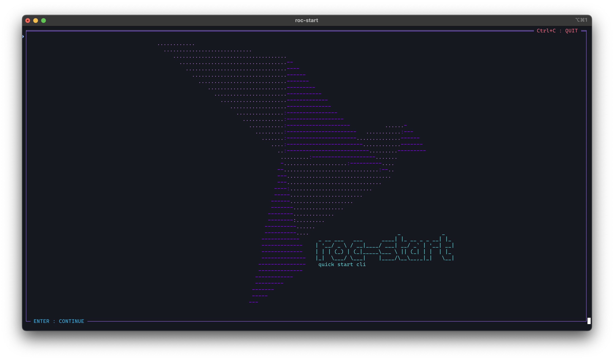

a# `roc-start` CLI tool 🚀

[![Roc-Lang][roc_badge]][roc_link]
[![GitHub last commit][last_commit_badge]][last_commit_link]
[![CI status][ci_status_badge]][ci_status_link]



Roc-start is a CLI tool for generating dependency headers for a new roc application or package, or upgrading the dependencies in an existing roc file.

Starting a new roc app which requires multiple packages can be a bit cumbersome, due to the requirement for long urls which cannot be easily memorized. This typically requires opening previous projects which have some of the same dependencies, and copy/pasting from there, or visiting multiple github pages, finding the release page, and copying the url of the required assets.

Roc-start is intended to streamline this process.

Roc-start maintains a repository of package and platform git repos. From this list, it will fetch the URLs for all releases for each platform and package. Then with a simple command, you can generate a new roc application or pacakge file, or upgrade the dependencies in an existing one. Roc start even aids in platform and package discovery, by allowing you to browse and search for packages and platforms.


### New Features 
__As of 0.6.0:__
- Support for multiple packages or platforms with the same name, but different owners
- Support for specifying the package or platform version, or default to latest if not specified
- Specifying the filename and platform is optional, will default to main.roc and basic-cli:latest
- Default platform and version can be configured to use the user's preferred platform and version
- Packages and platforms whose names are not ambiguous can be specified without the owner
- If the requested package or platform repo or version cannot be resolved, appropriate warnings will be given
- Stub application code is generated dynamically based on the specified platform version 
- Progress bar displayed while updating local package, platform and script cache
- TUI interface supports doing all actions available through the CLI

__Post 0.6.0:__
- 0.6.3: User defined color themes in `$HOME/.rocstartthemes`
- 0.6.5: Support for Vim motions for menu navigation
- 0.6.6: Flags (like `force`) are selectable in the TUI
- 0.6.6: Install script will install terminal autocompletion in zsh and bash
- 0.7.0: Platform scripts renamed to plugins for better clarity on purpose
- 0.7.3: Roc-start can install its own updates, if it was installed using the install script.

## Installing:
If you already have the github cli installed (gh, not git), installing roc-start is as easy as running the install script in the root directory of the roc-start repository (install.sh).

> __Important:__
> Roc-start depends on the github cli tool to get the latest releases, and cannot run at all without `gh` installed.
> Go to https://cli.github.com to install the `gh` tool, and then run `gh auth login`.

Once the github cli tool is installed and authenticated, chdir into the base roc-start repository directory and run:
```sh
chmod +x install.sh && ./install.sh
```
Roc-start is now installed to `$HOME/.local/bin/`. The first time you run `roc-start`, it will download all release data for each platform and package in its repository, as well as the code generation scripts. You're all ready to go!

> __Linux Users:__
> Due to ongoing problems with both the surgical and legacy linkers on Linux, roc-start may have issues on your machine. In my testing, building roc-start with the legacy linker causes a segfault when the executable is run, and building with the surgical linker with the `--optimize` flag fails entirely. 
>
> For these reasons, the install script does not use the optimize flag when installing on Linux. The CLI app still works great, and you should be able to use it without issue. However, the TUI depends heavily on these optimizations, and it is likely you may encounter poor performance and even crashes in the TUI when built without optimization.

### Nix

Roc-start is also distributed via Nix flake. This means that Nix users can run it using
```
  nix run github:imclerran/roc-start
```
or add roc-start package exported from this flake to system configuration.
```
  inputs = {
    roc-start.url = "github:imclerran/roc-start";
  };

  .... later in configuration
  devShell = pkgs.mkShell { packages = [ inputs.roc-start.packages.${system}.default ]; };
```

## Two workflows

1) Use the CLI with your prefered arguments:
   - `roc-start app roc-ansi roc-json roc-ai:0.10.0`

  

   
2) Launch the TUI app to browse and search for packages and platforms:
   - `roc-start`

  

## Usage

Starting a new app is as easy as running `roc-start app`. This will use your default platform, with the filename "main.roc".
Alternatively, you can:
- Use `--platform`, to specify the platform. You may include the version tag or leave it off to use the latest release:
    - `--platform basic-cli` or `--platform basic-cli:0.19.0`.
- Append as many packages as you want. These may include or ommit the version like the platform, but no option is required.
    - `roc-start app roc-json:0.12.0`
- Specify the output filename, if you want something besides main.roc:
    - `roc-start app --out hello-world` or `roc-start app --out hello-world.roc`
- Upgrade an existing app or package with `--upgrade`. In this case, specify the file to upgrade with `--in`, or leave it off to use "main.roc"
    - otherwise, the arguments will be the same as `app`. 

## Updating platform/package urls

The first time roc-start is run, it will automatically get the latest release urls for the platforms and packages in its repository. These can be updated again at any time by running:
- `roc-start update`, which will update everything, or with any or all of `--packages`, `--platforms`, or `--scripts`, to update specific components.
- `roc-start`, and selecting "update roc-start" from the main menu, and continuing on to confirmation"
  
## Getting your package or platform added to roc-start

To make your package or platform available in roc-start, simply make a pull request to the https://github.com/imclerran/roc-repo, and add your repo to appropriate CSV file (packages.csv, or platforms.csv).

## Help pages
### roc-start --help
```
A simple CLI tool for starting or upgrading roc projects. Specify your platform and packages by name, and roc-start will create a new .roc file or update an existing one with the either the versions you specify, or the latest releases. If no arguments are specified, the TUI app will be launched instead.

Usage:
  roc-start -v/--verbosity STR [options]
  roc-start <COMMAND>

Commands:
  update   Update the platform and package repositories and plugins. Update all, or specify which to update.
  app      Create a new roc app with the specified name, platform, and packages.
  package  Create a new roc package main file with all specified packages dependencies.
  upgrade  Upgrade the platform and/or packages in an app or package
  config   Configure the default settings for the roc-start CLI tool.

Options:
  -v STR, --verbosity STR  Set the verbosity level to one of: verbose, quiet, or silent.
  -h, --help               Show this help page.
  -V, --version            Show the version.
```

### roc-start app --help
```
Create a new roc app with the specified name, platform, and packages.

Usage:
  roc-start app -o/--out STR -p/--platform STR [options] <packages...>

Arguments:
  <packages...>  Any packages to use. Set the version of the package with `<package>:<version>`. If version is not set packages will default to the latest version.

Options:
  -f, --force             Force overwrite of existing file.
  --no-plugin             Force roc-start to use fallback generation insteaad of platform specific plugin.
  -o STR, --out STR       The name of the output file (Defaults to `main.roc`). Extension is not required.
  -p STR, --platform STR  The platform to use (Defaults to `basic-cli=latest` unless otherwise configured). Set the version with `--platform <platform>:<version>`.
  -h, --help              Show this help page.
  -V, --version           Show the version.
```

### roc-start upgrade --help
```
Upgrade the platform and/or packages in an app or package

Usage:
  roc-start upgrade -i/--in STR -p/--platform STR [options] <packages...>

Arguments:
  <packages...>  List of packages upgrade. If ommitted, all will be upgraded. Version may be specified, or left out to upgrade to the latest version.

Options:
  -i STR, --in STR        The name of the input file who's platforms and/or packages should be upgraded.
  -p STR, --platform STR  Specify the platform and version to upgrade to. If ommitted, the platform will not be upgraded. If the specified platform is different than the platform in the upgraded file, the platform will be replaced with the specified one.
  -h, --help              Show this help page.
  -V, --version           Show the version.
```

### roc-start update --help
```
Update the platform and package repositories and plugins. Update all (excluding installation), or specify which to update.

Usage:
  roc-start update [options]

Options:
  -k, --packages   Update the package repositories.
  -f, --platforms  Update the platform repositories.
  -s, --plugins    Update the platform plugins.
  -t, --themes     Update the available color themes.
  -i, --install    Install the latest version of roc-start.
  -h, --help       Show this help page.
  -V, --version    Show the version.
```

<!-- [roc_badge]: https://img.shields.io/endpoint?url=https%3A%2F%2Fpastebin.com%2Fraw%2FGcfjHKzb -->
[roc_badge]: https://img.shields.io/endpoint?url=https%3A%2F%2Fpastebin.com%2Fraw%2FcFzuCCd7
[roc_link]: https://github.com/roc-lang/roc

[ci_status_badge]: https://img.shields.io/github/actions/workflow/status/imclerran/roc-start/ci.yaml?logo=github&logoColor=lightgrey
[ci_status_link]: https://github.com/imclerran/roc-start/actions/workflows/ci.yaml
[last_commit_badge]: https://img.shields.io/github/last-commit/imclerran/roc-start?logo=git&logoColor=lightgrey
[last_commit_link]: https://github.com/imclerran/roc-start/commits/main/
