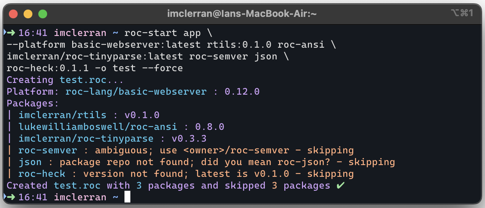

# `roc-start` CLI tool 🚀

[![Roc-Lang][roc_badge]][roc_link]
[![GitHub last commit][last_commit_badge]][last_commit_link]
[![CI status][ci_status_badge]][ci_status_link]

Roc-start is a CLI tool for generating application headers for a new roc application.

Starting a new roc app which requires multiple packages can be a bit cumbersome, due to the requirement for long urls which cannot be easily memorized. This typically requires opening previous projects which have some of the same dependencies, and copy/pasting from there, or visiting multiple github pages, finding the release page, and copying the url of the required assets.

Roc-start is intended to streamline this process.

Roc-start maintains a repository of package and platform git repos. From this list, it will fetch the URLs for all releases for each platform and package. Then with a simple command, you can generate a new roc application or pacakge file, or upgrade the dependencies in an existing one. Roc start even aids in platform and package discovery, by allowing you to browse and search for packages and platforms.

## Installing:
If you already have the github cli installed (gh, not git), installing roc-start is as easy as running the install script in the root directory of the roc-start repository (install.sh).

> __Important:__
> Roc-start depends on the github cli tool to get the latest releases, and cannot run at all without `gh` installed.
> Go to https://cli.github.com to install the `gh` tool, and then run `gh auth login`.

Once the github cli tool is installed and authenticated, chdir into the base roc-start repository directory and run:
```sh
chmod +x install.sh && ./install.sh
```
Roc-start is now installed to `$HOME/.local/bin/`. The first time you run `roc-start`, it will download all release data for each platform and package in its repository, as well as the code generation scripts. You're all ready to go!

## Two workflows

1) Use the CLI with your prefered arguments:
   - `roc-start app roc-ansi roc-json roc-ai:0.10.0`

  

   
2) Launch the TUI app to browse and search for packages and platforms:
   - `roc-start`

  

## Usage

Starting a new app is as easy as running `roc-start app`. This will use your default platform, with the filename "main.roc".
Alternatively, you can:
- Use `--platform`, to specify the platform. You may include the version tag or leave it off to use the latest release:
    - `--platform basic-cli` or `--platform basic-cli:0.19.0`.
- Append as many packages as you want. These may include or ommit the version like the platform, but no option is required.
    - `roc-start app roc-json:0.12.0`
- Specify the output filename, if you want something besides main.roc:
    - `roc-start app --out hello-world` or `roc-start app --out hello-world.roc`
- Upgrade an existing app or package with `--upgrade`. In this case, specify the file to upgrade with `--in`, or leave it off to use "main.roc"
    - otherwise, the arguments will be the same as `app`. 

## Updating platform/package urls

The first time roc-start is run, it will automatically get the latest release urls for the platforms and packages in its repository. These can be updated again at any time by running:
- `roc-start update`, which will update everything, or with any or all of `--packages`, `--platforms`, or `--scripts`, to update specific components.
- `roc-start`, and selecting "update roc-start" from the main menu, and continuing on to confirmation"
  
## Getting your package or platform added to roc-start

To make your package or platform available in roc-start, simply make a pull request to the https://github.com/imclerran/roc-repo, and add your repo to appropriate CSV file (packages.csv, or platforms.csv).

## Help pages
### roc-start --help
```
A simple CLI tool for starting or upgrading roc projects. Specify your platform and packages by name, and roc-start will create a new .roc file or update an existing one with the either the versions you specify, or the latest releases. If no arguments are specified, the TUI app will be launched instead.

Usage:
  roc-start -v/--verbosity STR --theme STR [options]
  roc-start <COMMAND>

Commands:
  tui      Use the TUI app to browse and search for platforms and packages.
  update   Update the platform and package repositories and scripts. Update all, or specify which to update.
  app      Create a new roc app with the specified name, platform, and packages.
  package  Create a new roc package main file with all specified packages dependencies.
  upgrade  Upgrade the platform and/or packages in an app or package
  config   Configure the default settings for the roc-start CLI tool.

Options:
  -v STR, --verbosity STR  Set the verbosity level to one of: verbose, quiet, or silent.
  --theme STR              Set the color theme to use one of: roc-mono, roc-c16, roc, warn-only, no-color, coffee-cat-dark, coffee-cat-light.
  -h, --help               Show this help page.
  -V, --version            Show the version.
```

### roc-start app --help
```
Create a new roc app with the specified name, platform, and packages.

Usage:
  roc-start app -o/--out STR -p/--platform STR [options] <packages...>

Arguments:
  <packages...>  Any packages to use. Set the version of the package with `<package>:<version>`. If version is not set packages will default to the latest version.

Options:
  -f, --force             Force overwrite of existing file.
  -o STR, --out STR       The name of the output file (Defaults to `main.roc`). Extension is not required.
  -p STR, --platform STR  The platform to use (Defaults to `basic-cli=latest` unless otherwise configured). Set the version with `--platform <platform>:<version>`.
  -h, --help              Show this help page.
  -V, --version           Show the version.
```

### roc-start upgrade --help
```
Upgrade the platform and/or packages in an app or package

Usage:
  roc-start upgrade -i/--in STR -p/--platform STR [options] <packages...>

Arguments:
  <packages...>  List of packages upgrade. If ommitted, all will be upgraded. Version may be specified, or left out to upgrade to the latest version.

Options:
  -i STR, --in STR        The name of the input file who's platforms and/or packages should be upgraded.
  -p STR, --platform STR  Specify the platform and version to upgrade to. If ommitted, the platform will not be upgraded. If the specified platform is different than the platform in the upgraded file, the platform will be replaced with the specified one.
  -h, --help              Show this help page.
  -V, --version           Show the version.
```

<!-- [roc_badge]: https://img.shields.io/endpoint?url=https%3A%2F%2Fpastebin.com%2Fraw%2FGcfjHKzb -->
[roc_badge]: https://img.shields.io/endpoint?url=https%3A%2F%2Fpastebin.com%2Fraw%2FcFzuCCd7
[roc_link]: https://github.com/roc-lang/roc

[ci_status_badge]: https://img.shields.io/github/actions/workflow/status/imclerran/roc-start/ci.yaml?logo=github&logoColor=lightgrey
[ci_status_link]: https://github.com/imclerran/roc-start/actions/workflows/ci.yaml
[last_commit_badge]: https://img.shields.io/github/last-commit/imclerran/roc-start?logo=git&logoColor=lightgrey
[last_commit_link]: https://github.com/imclerran/roc-start/commits/main/
